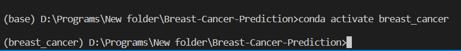
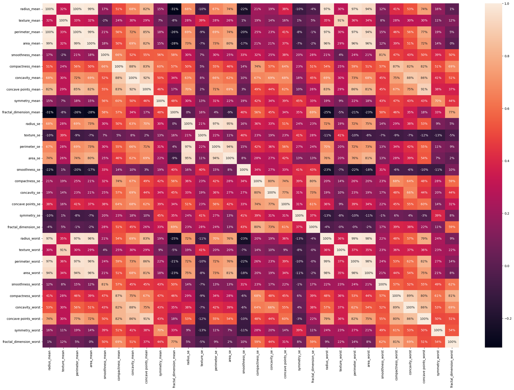
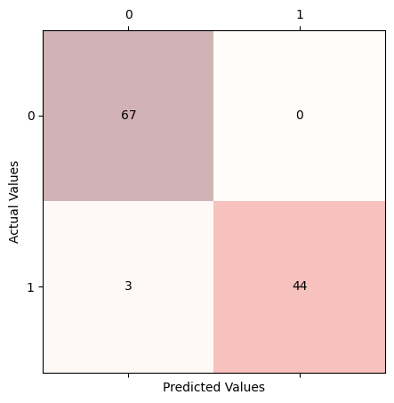

`conda create -n breast_cancer`

# Installing the appropriate library
`pip install matplotlib numpy pandas seaborn `
## Activating the notebook

`jupyter notebook`
The data has been downloaded from the kaggle [https://www.kaggle.com/datasets/uciml/breast-cancer-wisconsin-data]
Correlation

Result:
Logistic Regression

Decision Tree

Random Forest

SVC

